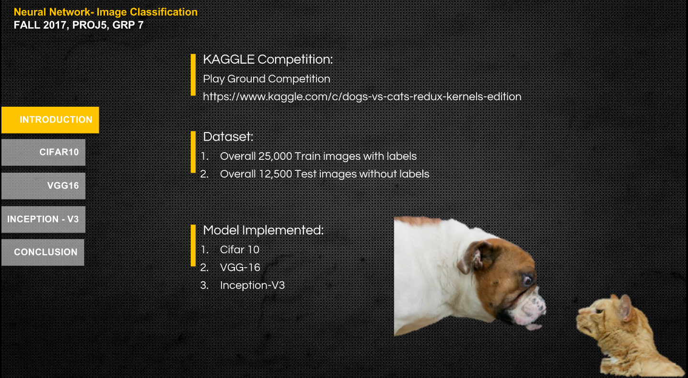
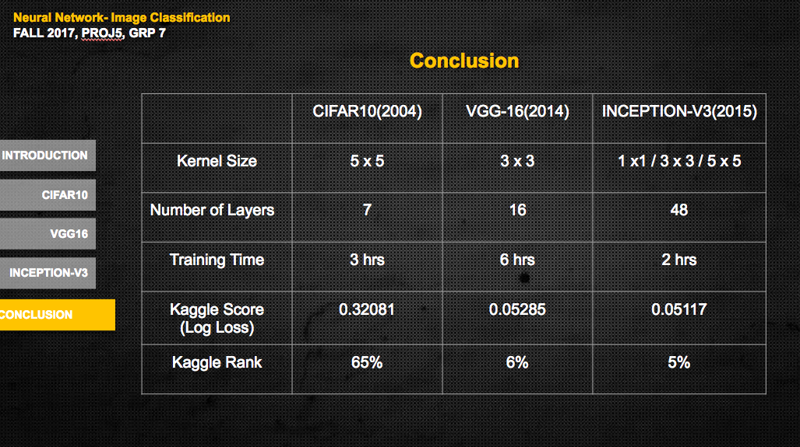
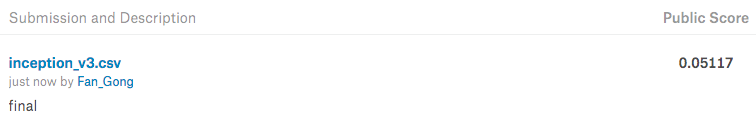
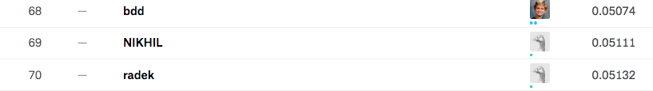

# Dogs vs Cats Image Recognition


In this project, we use three neural network models to do image recognition -- Cifar 10, VGG-16 and Inception-V3. These models are implemented to classifiy 12500 cat/dog images. The prediction performance of three model has ranking of 65%, top 6.6%, top 5.3% in the Kaggle competition respectively. Based on that, we also compare the models and get some interesting findings of the results.

+ Main File Link : [Click Here](https://github.com/TZstatsADS/Fall2017-project5-grp7/blob/master/doc/main.ipynb )
+ Presentation Slides Link : [Click Here](https://github.com/TZstatsADS/Fall2017-project5-grp7/blob/master/doc/proj5-grp7.pptx)
	
### Project summary: 




### Project Conclusion  



* Kaggle Best Ranking 

Our best model ranked top 5.3% in kaggle competition, here are the screenshots:



	
Following [suggestions](http://nicercode.github.io/blog/2013-04-05-projects/) by [RICH FITZJOHN](http://nicercode.github.io/about/#Team) (@richfitz). This folder is orgarnized as follows.

```
proj/
├── lib/
├── data/
├── doc/
├── figs/
└── output/
```

Please see each subfolder for a README file.
